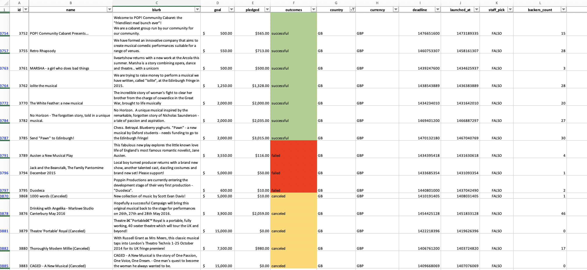
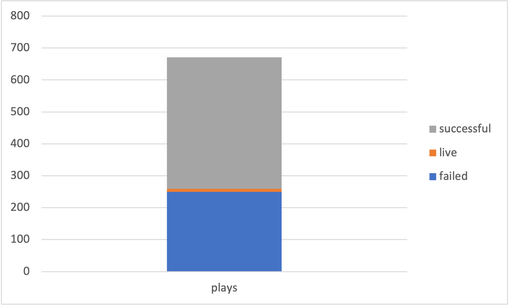
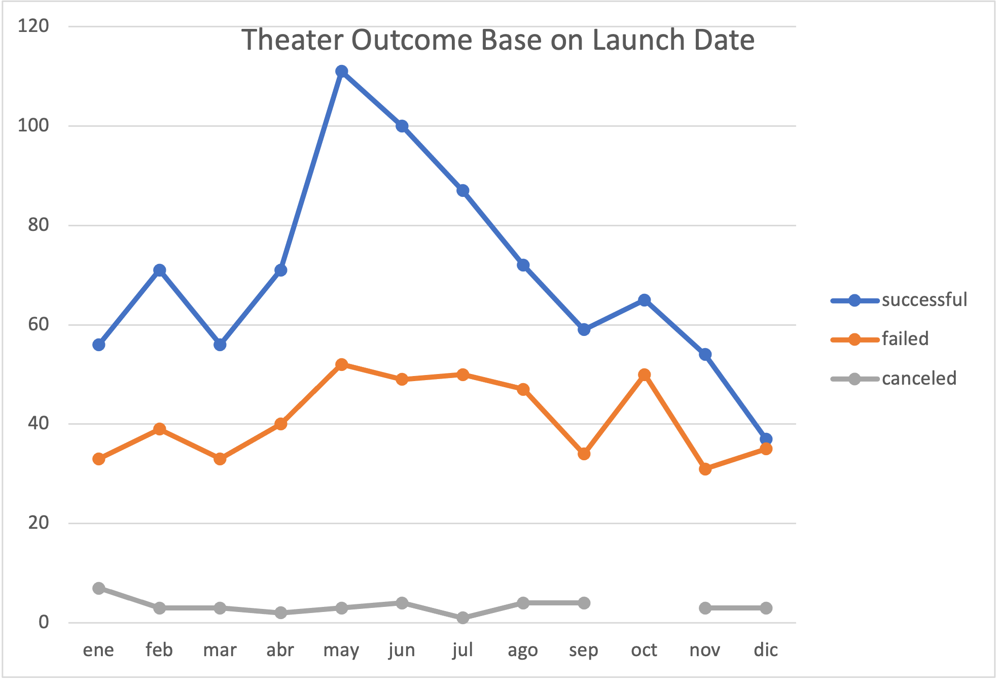
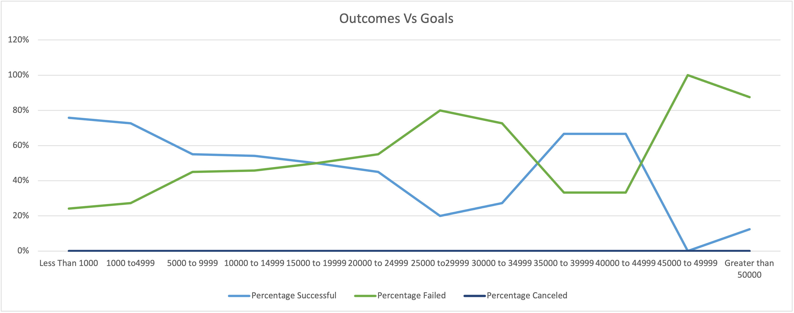

# An Analysis of Kickstarter Campaigns
Performing analysis on Kickstarter data to uncover trends
# Kickstarting with Excel

## Overview of Project
Analyze crowdfunding data to determine whether there are specific factors that made a project campaign successful. And this way we can help Louise plan her campaign and have a successful outcome.

## Analysis and Challenges
The first thing I did was color code some of the information so that it would be easier to read, then I added some important information, like percentages and averages donations, this information is very important so that we can get an idea of how much money Louise should ask for.

After that, I focus on extracting information specifically from US and theaters campaigns, given that those are the ones mirroring Louise's. I made a bar chart to illustrate How many theater campaigns in the US had succeeded and how many had failed, then I made it even more specific by analyzing only the theater plays campaigns. By this point, Louise would already have an idea of how likely it would be that a theater play camping in the US could succeed and the odds were looking good.

Now we needed to know when would be the best time for Louise to launch her campaign, so I made a pivot table demonstrating the number of successful and failed campaigns depending on the launch month

Once we had the launch date, we needed to know how much should Louise ask for, so we needed to create a new table where we could see the percentage of successful and failed campaigns based on what their goal was after adding this new table and a line graph to go with it we had the final information that louse needed to launch her campaign.

Some of the challenges that we encounter were in this last analysis of outcomes based on goal because the data is not as clear as with the launch dates, so we need to pay a little more attention to all the different factors so that we can make the right desition 

## Analysis of Outcomes Based on Launch Date

After the analysis of theater outcome by launch date, we can conclude that the best launch date for Louise's campaign would be between June and May.

The second conclusion we can get from this is that December would be the worst time to launch the campaign.

## Analysis of Outcomes Based on Goals
After analyzing the outcome based on goal data we can conclude  that asking over 45000 would result in certain failure but the 10000 that Louise is asking for has good odds.

## Challenges and Difficulties Encountered

Some of the limitations we encounter in this data set, are that we have no information of what are the reasons for campaign failure, and that could have been very useful in the planning of Louise's campaign.

Other graphs that we could create would be one containing the backer count compared to the average donation, this could be very helpful to know how many backers to expect and which gifts to put for the donations ranges.

